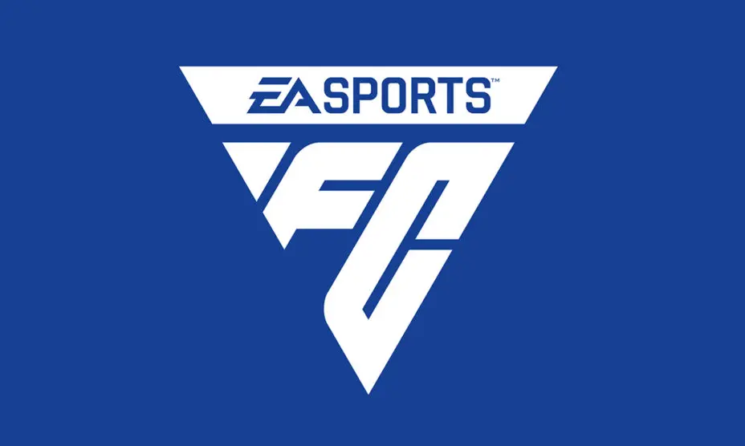
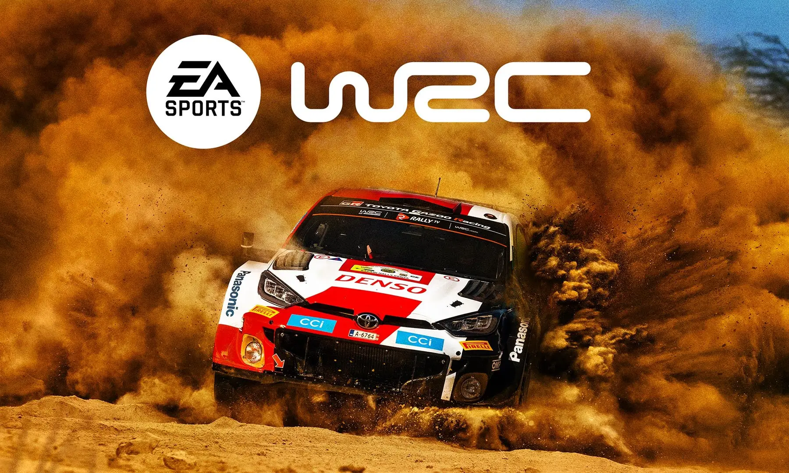
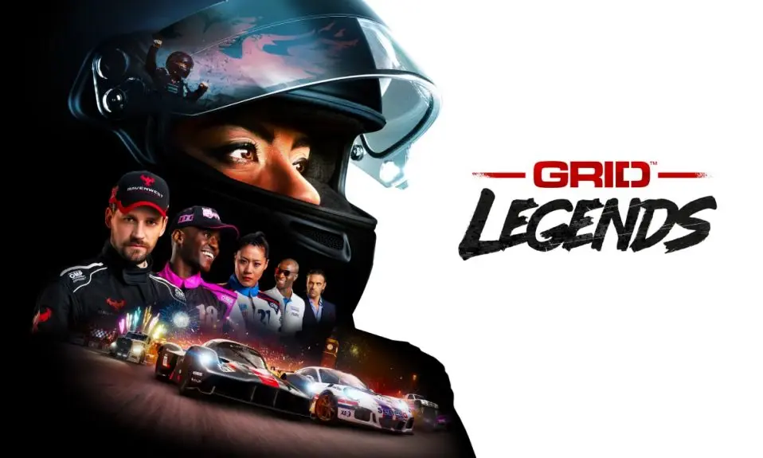
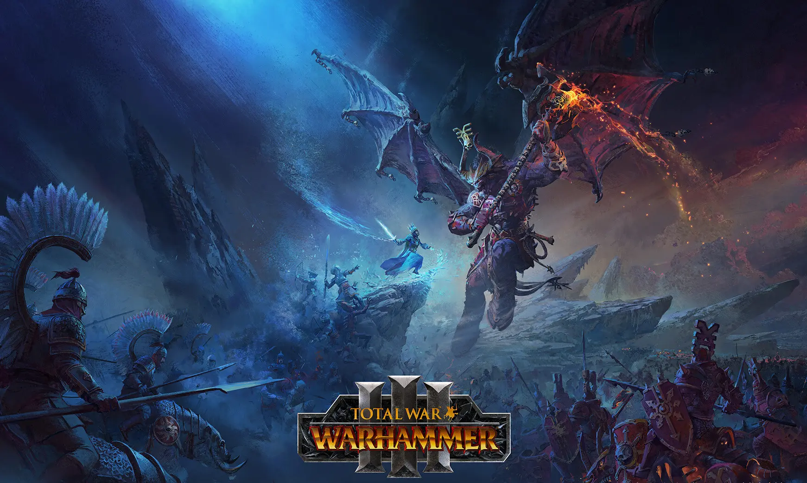
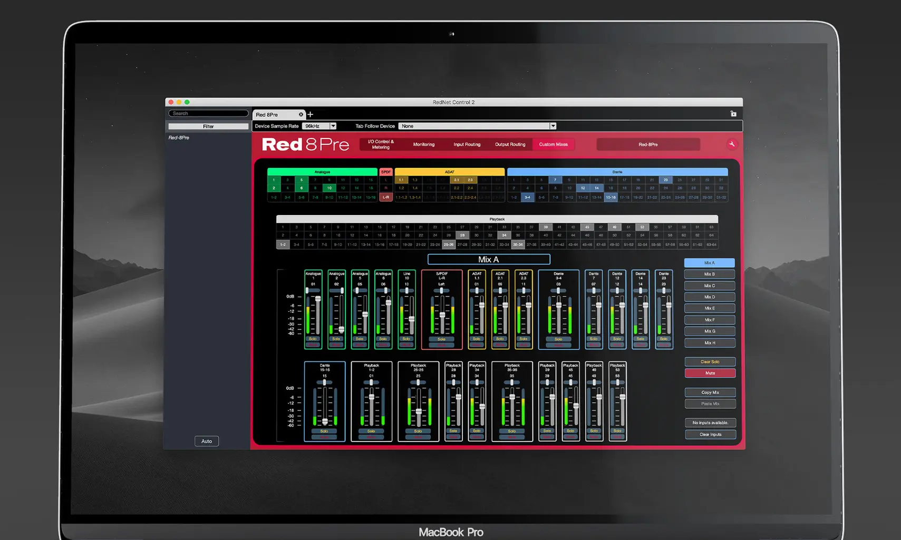
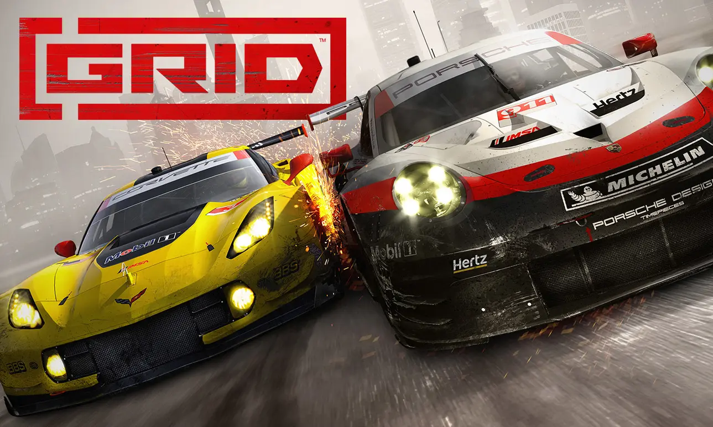

# 🤫

Software developer
 Formerly at [Electronic Arts](https://ea.com), [Creative Assembly](https://www.creative-assembly.com/), [Focusrite](https://focusrite.com/) and [Codemasters](https://www.ea.com/ea-studios/codemasters).

## Projects

### EA Sports FC

**Electronic Arts**
 
<em>Software Engineer II</em>
  
C++ development for PC, PS5, XSX.
* Leading a small team of engineers joining FC for the first time to plan and implement career mode features.

### EA Sports WRC (2023)

**Electronic Arts**
 
<em>Software Engineer II</em>
  
C++ development for PC, PS5, XSX, including Unreal Engine and  Wwise audio middleware.
* Updated and maintained vehicle audio runtime DSP and C# authoring tools.
* Worked on audio gameplay systems including vehicles, collisions, reflections, animations,  UI and environmental audio.
* Additional physics code maintenance to fix collision/entity issues.

### Grid Legends (2022)

**Electronic Arts**
 
<em>Software Engineer I</em>
  
C++ development for PC, PS5, XSX.
* Worked on various game modes including related networking and UI support.

### Total War: Warhammer III (2022)

**Creative Assembly**
 
<em>Audio Programmer</em>
  
C++ development for PC, including Wwise audio middleware.
* Worked on audio gameplay systems including  animation runtime logic and tools, dialogue, environmental audio.

### Rednet Control

**Focusrite**
 
<em>Junior Software Engineer</em>
  
C++ desktop application development for Windows/MacOS using the Qt framework.
* UI implementation, communications between software and audio hardware.
* Set up Jenkins build automation and Windows installer support using Inno Setup.

### Grid (2019)

**Codemasters**
 
<em>Programmer</em>
  
C++ development for PC, PS4, Xbox One, including Wwise audio middleware.
* Worked on audio gameplay systems including vehicles, collisions, reflections, reverb, dialogue, UI, environmental audio and memory management.
* C# audio tools programming, including dialogue tools.

* Recommended by my colleagues for the [Game Dev Heroes 2019 award](https://gamedevheroes.co/2019-shortlist/).
